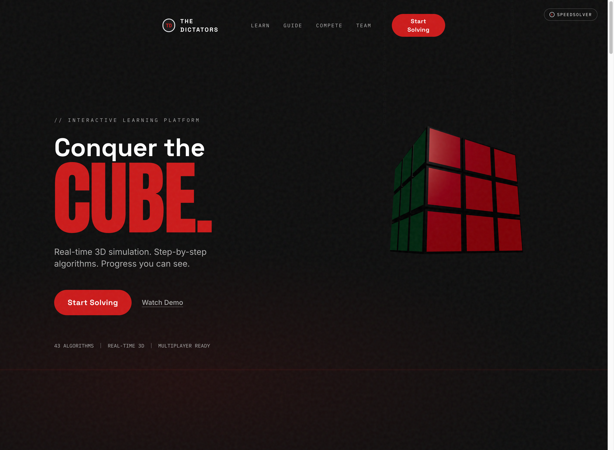
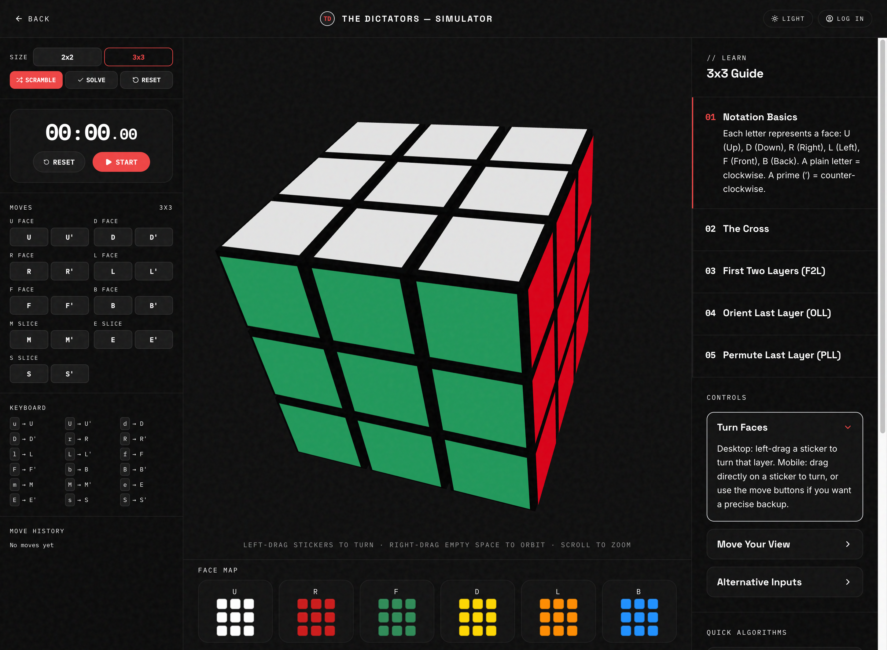
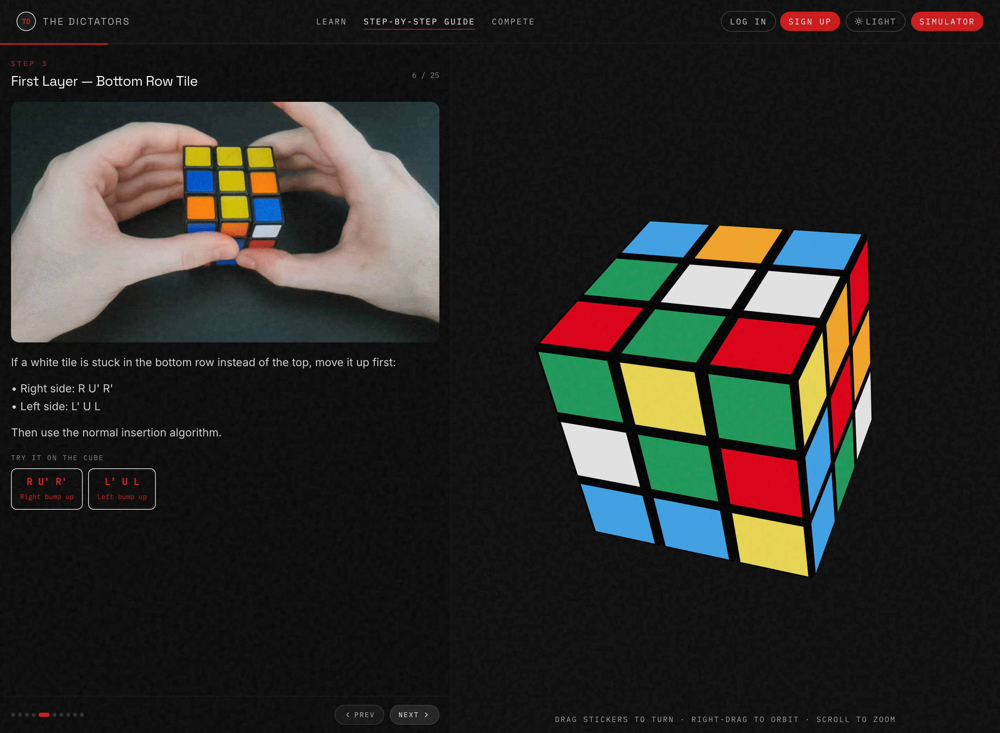
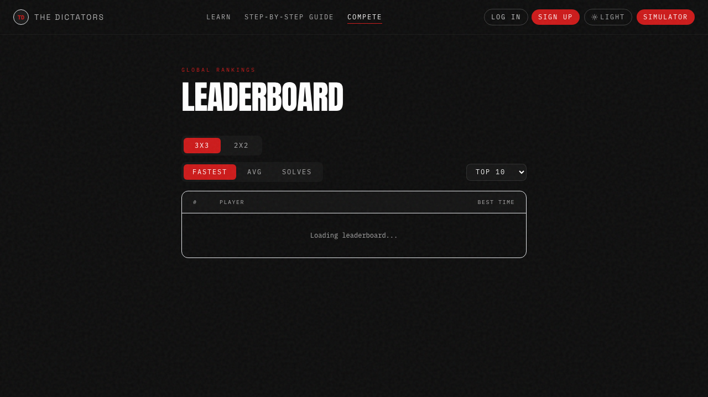

# The Dictators — 3D Rubik's Cube Platform

An interactive, browser-based 3D Rubik's Cube platform with real-time manipulation, guided tutorials, and a full-stack API.

## Features

| Feature | Description |
|---------|-------------|
| **3D Simulator** | Sticker-mesh Rubik's Cube with smooth move animations |
| **Size-Aware Engine** | Supports 2x2, 3x3, and 4x4 cubes |
| **Full Move Notation** | Face turns (U/D/L/R/F/B), slices (M/E/S), inner slices (r/l/u/d/f/b for 4x4) |
| **Tutorial System** | Step-by-step learning: cross, F2L, OLL, PLL |
| **Step-by-Step Guide** | Interactive solving guide with GIF animations, algorithm buttons, and live 3D cube |
| **Leaderboard** | 6 boards (2x2/3x3 × fastest/avg/solves) with result count dropdown — live Supabase data |
| **Profile** | Per-size stats with rank display — live Supabase data |
| **Authentication** | Sign up, log in, log out via Supabase Auth |
| **Database** | Supabase Postgres — users, solve stats, leaderboard rankings |
| **Algorithm Reference** | Quick-apply sequences (Sexy Move, Sune, U-Perm, etc.) |
| **REST API** | 5 endpoints: health, solved state, apply move, scramble, solve |
| **C++ WASM Solver** | Eric's CFOP solver compiled to WebAssembly — handles 3x3 |
| **Python NxN Solver** | Vendored solver for 2x2 and 4x4 cubes |
| **Branded Landing Page** | GSAP animations, React Three Fiber hero, responsive design |
| **Timer & History** | Move counting, solve timing, full move log |
| **2D Face Map** | Real-time unfolded cube visualization |
| **Keyboard Shortcuts** | Full notation mapped to keyboard (u/d/l/r/f/b/m/e/s) |

## Screenshots

| Page | Preview |
|------|---------|
| Landing |  |
| Simulator |  |
| Step-by-Step Guide |  |
| Leaderboard |  |

## Quick Start

```bash
npm install
npm run dev
```

Before running, make sure `frontend/.env` exists with your Supabase credentials:

```
VITE_SUPABASE_URL=your_supabase_url
VITE_SUPABASE_ANON_KEY=your_anon_key
```

See `frontend/.env.example` for the required variables. Get the values from the team's Supabase project.

## Start Here

If you are new to the repo, read in this order:

1. This root `README.md`
2. [docs/architecture.md](docs/architecture.md)
3. [docs/repo-organization-checklist.md](docs/repo-organization-checklist.md)

Important:
- this root README is the canonical onboarding document
- `frontend/README.md` only adds local frontend context
- `frontend-legacy/` is a legacy prototype and not the current app

## Run Frontend + API Together

```bash
npm install
npm run dev
```

Starts:
- Frontend dev server on `http://localhost:5400`
- API server on `http://localhost:5200`

Important:
- `frontend/` is the active frontend used by `npm run dev`
- `frontend-legacy/` is an older prototype and is not the live app
- In local dev, the frontend still calls `/api/v1/*`
- Vite proxies `/api/v1/*` from `5400` to the local API on `5200`
- Direct local API routes are also available at `http://localhost:5200/v1/*`

Why the API is on `5200`:
- Vite already uses `5400` for the frontend
- keeping the API on `5200` avoids a port collision
- this mirrors a clean split: browser app on one port, API on another, with the frontend proxy hiding that split during development

## Routes

| Route | Component | Description |
|-------|-----------|-------------|
| `/` | Landing page | Hero, features, team |
| `/simulator` | `SimulatorPage.jsx` | Interactive 3D cube |
| `/step-by-step` | `StepByStepPage.jsx` | Guided solving with GIFs and live cube |
| `/learn` | `LearnPage.jsx` | Learning modules |
| `/leaderboard` | `LeaderboardPage.jsx` | 6 leaderboards (2x2/3x3 × fastest/avg/solves) |
| `/profile` | `ProfilePage.jsx` | Per-size stats with rank display |

## Project Structure

```
the-dictators/
├── api/                              Vercel serverless (production)
│   ├── solver.js                     Compiled C++ WASM binary
│   └── v1/[...path].js              Thin adapter — delegates to routes.js
│
├── frontend/                         React + Vite + Tailwind (the live app)
│   └── src/
│       ├── components/               Landing page sections (Hero, Features, Team, etc.)
│       ├── cube/                     Shared cube model — used by BOTH frontend and backend
│       │   ├── cubeModel.js          State format, face order, validation
│       │   ├── moves.js              Size-aware move engine (all rotations)
│       │   └── CubeState.js          State wrapper class
│       ├── lib/                      Supabase integration
│       │   ├── supabase.js           Supabase client init
│       │   ├── auth.js               Sign up, log in, log out, session
│       │   └── stats.js              Leaderboard and profile data queries
│       ├── net/api.js                Frontend API client (fetch calls to backend)
│       ├── pages/simulator/          The simulator page
│       │   ├── SimulatorPage.jsx     Main page — wires everything together
│       │   ├── InteractiveCube.jsx   3D cube (Three.js / React Three Fiber)
│       │   ├── SimulatorControls.jsx Left panel: buttons, move history
│       │   ├── TutorialPanel.jsx     Right panel: learning guide
│       │   ├── useTimer.js           Timer hook
│       │   ├── useCubeControls.js    Keyboard + mouse input
│       │   ├── useSimulatorQueue.js  Move queue + animation lifecycle
│       │   ├── useSimulatorActions.js Scramble, solve, reset actions
│       │   ├── simulatorAnimation.js GSAP animation config
│       │   └── simulatorConstants.js Key mappings, move groups
│       ├── pages/step-by-step/           Step-by-step solving guide
│       │   ├── GuidePanel.jsx            Left panel: text, GIFs, algorithm buttons
│       │   └── stepsData.js              25-slide guide data with algorithms
│       ├── pages/StepByStepPage.jsx      Guide + live cube side-by-side
│       ├── pages/LeaderboardPage.jsx     6 leaderboards (2x2/3x3 × 3 stats)
│       ├── pages/ProfilePage.jsx         Per-size stats with rank display
│       ├── pages/LearnPage.jsx           Learning modules (Eric Solano)
│       └── utils/                    Shared utilities
│
├── backend/
│   ├── api/src/                      Node.js API server
│   │   ├── README.md                 Detailed backend guide (start here!)
│   │   ├── routes.js                 All endpoint handlers (single source of truth)
│   │   ├── server.js                 Local dev HTTP server (port 5200)
│   │   ├── cube.js                   Bridge — imports shared cube model from frontend
│   │   ├── validation.js             Request validation
│   │   ├── mockServer.js             Fake API for frontend testing
│   │   ├── solverHybrid.test.js      Integration tests
│   │   └── solvers/                  All solver implementations
│   │       ├── wasmSolver.js         C++ WASM bridge (3x3)
│   │       ├── pythonNxNSolver.js    Python bridge (2x2, 4x4)
│   │       ├── pythonNotation.js     Notation translation
│   │       ├── nxn_solver_bridge.py  Python subprocess
│   │       └── solvePipeline.js      Replay validation
│   ├── src/cube/                     C++ solver source (Eric)
│   │   ├── PuzzleCube.h/.cpp        Cube state + rotation logic
│   │   ├── CubeOperations.cpp       CFOP solving algorithm (872 lines)
│   │   └── solver_bridge.cpp        Emscripten/WASM bridge
│   └── vendor/                       Vendored Python NxN solver
│
├── frontend-legacy/                  Legacy prototype — NOT used, kept for reference
├── docs/                             Architecture & contribution docs
├── scripts/                          Dev tooling (setup, dev runner)
├── vercel.json                       Vercel build config + API rewrites
└── package.json                      Workspace root
```

## How Everything Connects (The Big Picture)

```
                    ┌─────────────────────────────────┐
                    │          YOUR BROWSER            │
                    │   http://localhost:5400           │
                    └───────────┬─────────────────────┘
                                │
              ┌─────────────────┴──────────────────────────────────┐
              │                          │                          │
       Landing Page       ┌─────────────┴──────────────┐    ┌──────┴───────────────┐
    (components/*.jsx)    │                             │    │  LeaderboardPage /   │
                          │                    Step-by-Step  │    ProfilePage       │
                   Simulator Page              Guide Page    └──────┬───────────────┘
              (pages/simulator/*.jsx)   (StepByStepPage.jsx)        │
                          │                     │                   │
               ┌──────────┴──────────┐          │                   │
               │                     │          │                   │
         3D Cube Rendering     Move Buttons /   │                   │
         (InteractiveCube)     Keyboard Input   │                   │
               │              (useCubeControls) │                   │
               └──────────┬──────────┘          │                   │
                          │                     │                   │
                   cube/moves.js ◄──────────────┘                   │
                (shared move engine)                                 │
                          │                                          │
                   net/api.js                                        │
               (calls the backend)                                   │
                          │                                          │
             ┌────────────┴────────────────────────────────────┐    │
             │                                                  │    │
      ┌──────┴──────┐                               ┌──────────┴────┴────────┐
      │   API        │                               │       Supabase         │
      │  routes.js  │                               │   (Auth + Postgres)    │
      └──────┬──────┘                               └──────────┬─────────────┘
             │                                                  │
  ┌──────────┼───────────┐                    ┌────────────────┴────────────────┐
  │          │           │                    │                                  │
3x3 Solve  2x2/4x4  Scramble           lib/auth.js                       lib/stats.js
(C++ WASM) (Python)  (WASM)         (sign up/login)               (leaderboard/profile)
  │          │           │
  └──────────┼───────────┘
                    │
             solvePipeline
          (replay validation)
```

## API Endpoints

| Method | Path | Description |
|--------|------|-------------|
| GET | `/v1/health` | Service heartbeat |
| GET | `/v1/cube/state/solved?size=3` | Returns solved state (2, 3, or 4) |
| POST | `/v1/cube/moves/apply` | Apply a move to a state |
| POST | `/v1/cube/scramble` | Generate scramble + resulting state |
| POST | `/v1/cube/solve` | Solve a cube (3x3 via WASM, 2x2/4x4 via Python) |

Both the local dev server (port 5200) and the Vercel production handler use the same route table in `routes.js` — one source of truth.

## Cube State Contract

Faces: `U`, `R`, `F`, `D`, `L`, `B` — each an array of `size * size` sticker tokens.

```
3x3 index layout (row-major):
0 1 2
3 4 5
6 7 8

2x2: 4 stickers per face    (24 total)
3x3: 9 stickers per face    (54 total)
4x4: 16 stickers per face   (96 total)
```

Sticker tokens: `W` (white/up), `R` (red/right), `G` (green/front), `Y` (yellow/down), `O` (orange/left), `B` (blue/back).

## Build

```bash
cd frontend
npm run build
```

## Backend (C++)

```bash
cd backend
g++ -std=c++17 src/main.cpp src/cube/PuzzleCube.cpp src/cube/CubeOperations.cpp -o rubiks_solver
./rubiks_solver
```

## Deployment

The project is configured for **Vercel**:
- `frontend/` builds as the static site
- `api/v1/` routes map to serverless functions
- `vercel.json` configures build output and API rewrites

## Tech Stack

| Layer | Technology |
|-------|-----------|
| Frontend | React 18, Vite, Tailwind CSS, React Three Fiber, Three.js |
| Animations | GSAP, ScrollTrigger, eased quaternion interpolation |
| API | Node.js, OpenAPI 3.1, Vercel Serverless Functions |
| 3x3 Solver | C++17 compiled to WebAssembly via Emscripten |
| NxN Solver | Python 3 (vendored rubiks-cube-NxNxN-solver) |
| Database | Supabase (Postgres + Auth) |
| Version Control | Git, Bitbucket |
| Project Management | Jira |
| Documentation | Confluence |
