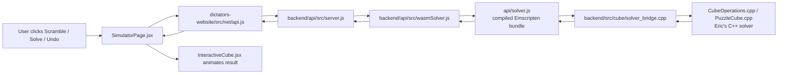
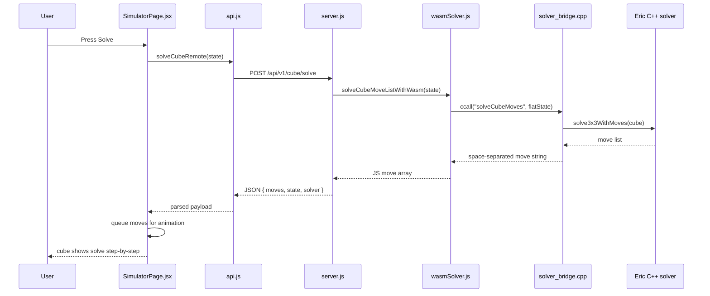
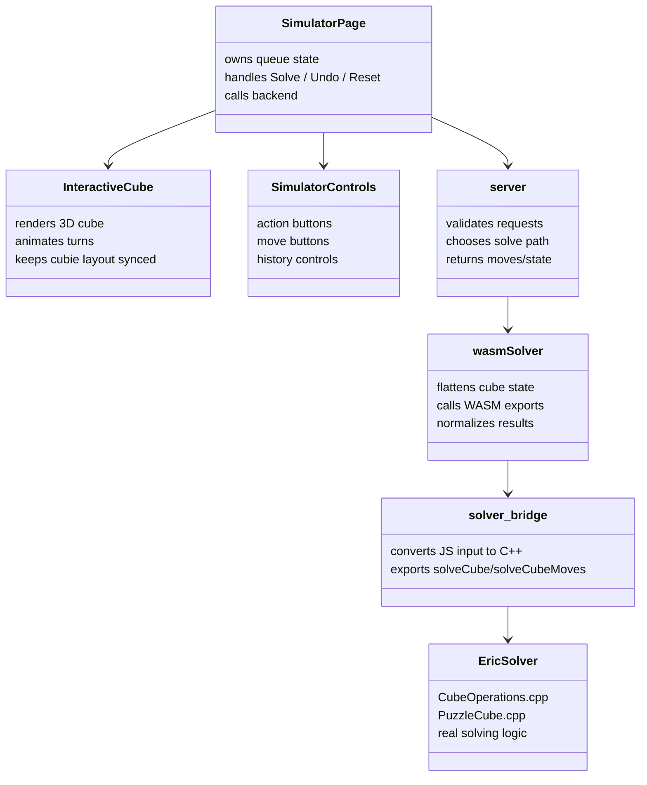

# Sprint 3 — Martin Ofunrein — Delivered Changes

**Branch:** `sprint-3-martin`  
**Scope updated:** April 15, 2026

## Plain-English summary

This sprint connected the website's Rubik's Cube simulator to Eric's real C++ solving code instead of relying only on frontend-only behavior.

In simple terms:
- the user turns or scrambles the cube in the website
- the website sends the current cube state to the backend
- the backend passes that state into Eric's C++ solver through a WASM bridge
- the solver returns either a move list or a solved state
- the frontend animates the returned solve moves when that replay is valid

Two other important UX changes also shipped:
- the cube flashing / color popping bug during turns was fixed
- `Undo` and `Undo All` were added so "undo history" is separate from "solve the cube"

## What was causing the cube flashing?

The flashing was not because Three.js itself was broken.

The real problem was the connection between:
- the visual 3D cubies on screen
- the logical cube state in code

Before the fix:
- a turn animation would visually rotate a layer
- but after that turn, the renderer snapped cubies back onto a static layout
- this made stickers appear to pop or flash because the model and the logical state were briefly out of sync

After the fix:
- the app keeps track of the cubies' updated positions after every move
- the cubies are reattached in their new rotated layout instead of being reset to an old one
- that keeps the 3D model and the cube state aligned

Short version:
- not a "Three.js is bad" issue
- it was a state-sync / animation-layout issue in how we were using Three.js

## How the whole system fits together

### Human explanation

Think of the app as four layers:

1. Frontend UI
- buttons, 3D cube, move history, timer
- this is what the user sees and clicks

2. Frontend networking layer
- takes the cube state and sends it to the backend API

3. Backend API + WASM adapter
- receives the cube state
- converts it into the exact format Eric's solver expects
- calls the compiled solver bundle

4. Eric's C++ solver
- does the actual solving work
- returns moves or a solved cube state

### System flow diagram



### Solve request sequence diagram



### High-level component map



## What shipped

### 1. Live simulator now uses Eric's C++ solver through the API

Delivered pieces:
- `backend/src/cube/solver_bridge.cpp`
  - WASM bridge for Eric's C++ solver
  - exports `solveCube` and `solveCubeMoves`
- `api/solver.js`
  - rebuilt Emscripten single-file WASM bundle
- `backend/api/src/wasmSolver.js`
  - shared Node-side loader for the WASM solver
  - flattens frontend cube state to the C++ input format
  - normalizes the solved output back to canonical frontend orientation
- `backend/api/src/server.js`
  - `/v1/cube/solve` now calls the real WASM solver
- `api/v1/[...path].js`
  - production/Vercel API route also calls the real WASM solver
- `dictators-website/src/net/api.js`
  - solve response now accepts solver move lists and solved cube state from the backend
- `dictators-website/src/pages/simulator/SimulatorPage.jsx`
  - solve button now calls the API
  - standard face-turn states now animate Eric's returned solve sequence
  - falls back to exact inverse-history solving for slice-turn states so the simulator does not hang on `M`, `E`, `S`
  - only snaps to solved state if move-list replay ever fails validation and the backend falls back to solved-state output

### 2. Color pop / flashing fix for the 3D cube

The live simulator was snapping cubies back onto a static layout after each turn, which caused sticker/color popping during turns, especially slice moves.

Delivered fix:
- `dictators-website/src/pages/simulator/simulatorAnimation.js`
  - added slice move animation support for `M`, `E`, `S`
  - added `rotateCubiePosition(...)`
- `dictators-website/src/pages/simulator/InteractiveCube.jsx`
  - `InteractiveCube` now tracks mutable cubie layout state
  - animated cubies are reattached and kept in their rotated positions after each move
- `dictators-website/src/pages/simulator/SimulatorPage.jsx`
  - solved-state resets rebuild layout cleanly

### 3. Solve playback was slowed slightly for readability

The solve animation was intentionally made a little slower so users can follow what the solver is doing.

Delivered change:
- `dictators-website/src/pages/simulator/simulatorAnimation.js`
  - manual turn duration stays fast at `0.24s`
  - automated solve playback now runs at `0.46s` per move
- `dictators-website/src/pages/simulator/SimulatorPage.jsx`
  - move queue can now carry a per-sequence animation speed
- `dictators-website/src/pages/simulator/InteractiveCube.jsx`
  - animation loop now accepts the requested move duration

Result:
- normal cube interaction still feels responsive
- solver playback is easier to watch step-by-step

### 4. Timer / interaction polish that remains active

The simulator still includes the earlier timer improvements:
- timer starts on first user move after scramble
- timer starts from a fresh solved/reset cube on first move
- best time persists in `localStorage`

### 5. Control panel now separates solving from undo history

The simulator action panel now keeps solve and undo as different concepts instead of mixing them together.

Delivered change:
- `dictators-website/src/pages/simulator/SimulatorControls.jsx`
  - action area expanded into a 2x3 grid
  - top row: `Scramble`, `Solve`, `Reset`
  - bottom row: `Undo`, `Undo All`, and one intentionally empty slot for layout balance
- `dictators-website/src/pages/simulator/SimulatorPage.jsx`
  - `Undo` now reverses exactly one move from the active move stack
  - `Undo All` reverses the full tracked move stack
  - `Solve` remains the dedicated "compute a real solve" path

Behavior decision:
- `Solve` means "run Eric's solver from this state" for standard face-turn states
- `Undo` means "step back one move"
- `Undo All` means "reverse the tracked history"
- slice states still use inverse-history behavior under solve fallback because the backend solver can still wedge on `M`, `E`, `S`

### 6. Simulator page refactor for readability and teammate handoff

The simulator feature was split into a dedicated feature folder so the main page is no longer carrying all rendering, timer, controls, tutorial, and animation code in one file.

Delivered refactor:
- `dictators-website/src/pages/simulator/SimulatorPage.jsx`
  - now acts as the feature coordinator only
  - owns page layout, move queue state, solve/reset/scramble handlers, timer wiring, and canvas fallback wiring
- `dictators-website/src/pages/simulator/InteractiveCube.jsx`
  - contains the 3D cube renderer and move animation flow
  - was cleaned up further with small local helpers for layout sync and layer animation
- `dictators-website/src/pages/simulator/SimulatorControls.jsx`
  - left panel controls and move buttons
- `dictators-website/src/pages/simulator/TutorialPanel.jsx`
  - right panel algorithm help / tutorial actions
- `dictators-website/src/pages/simulator/SimulatorFaceMap.jsx`
  - flat face-state readout
- `dictators-website/src/pages/simulator/CanvasFallbackPanel.jsx`
  - renderer failure fallback panel
- `dictators-website/src/pages/simulator/useTimer.js`
  - timer and best-time persistence
- `dictators-website/src/pages/simulator/useCubeControls.js`
  - keyboard + sticker-selection controls
- `dictators-website/src/pages/simulator/simulatorConstants.js`
  - feature constants and helpers
- `dictators-website/src/pages/simulator/simulatorAnimation.js`
  - animation helpers and cubie rotation math
- `dictators-website/src/pages/simulator/simulatorAnimation.test.js`
  - coverage for animation helpers

Folder decision:
- all simulator-only code now lives under `dictators-website/src/pages/simulator/`
- this keeps simulator logic together and makes ownership clearer for teammates
- `SimulatorPage.jsx` still exists because the route needs a page-level coordinator, but it is no longer the only simulator file

## Important solver note

Eric's C++ backend solver is now the real engine behind the live solve endpoint for both solved-state output and move-list output.

Current state:
- `solveCube` is verified and working through WASM
- `solveCubeMoves` is now also wired into the live API path for standard face-turn states
- the move-list path includes whole-cube rotations such as `x` and `y`, so the simulator now supports animating those rotations too
- slice-turn simulator states can still wedge the backend solver, so scramble generation stays restricted to standard face turns and slice states still solve from exact inverse history

Because of that, the frontend currently:
- sends standard face-turn cube states to the API
- receives Eric's move list back from the backend when replay validation succeeds
- animates that returned move list live in the simulator
- uses exact inverse move history for slice-turn states generated inside the simulator
- keeps the solved-state backend path only as a guarded fallback if move-list replay ever comes back invalid

This means scramble-button states and normal manual face-turn states now go through Eric's algorithm and animate the returned solve sequence instead of snapping directly to solved.

The new explicit undo controls are there so history reversal does not have to be overloaded onto the `Solve` button.

## When the app uses Eric's solver vs reverse history

The current rule is:

- `Solve` on standard face-turn states:
  - use Eric's C++ solver
- `Undo`:
  - reverse one move from tracked history
- `Undo All`:
  - reverse the full tracked history
- slice-heavy states involving `M`, `E`, `S`:
  - still rely on reverse history in some paths because the backend solver can wedge there

That separation is important because:
- "solve this cube" and
- "undo what the user just did"

are not the same action.

## Architecture decisions to keep

### 1. Keep both `backend/api/` and repo-root `api/`

We intentionally need both folders.

- `backend/api/`
  - local Node API for development
  - easy to run directly with `npm --prefix backend/api run serve`
  - used behind the Vite dev proxy
- `api/v1/`
  - Vercel production/serverless entrypoint
  - required because Vercel expects API routes at the repo root `api/` convention

Decision:
- do not delete either one
- they serve different runtimes
- local dev and deployed production would be harder to reason about if they were merged incorrectly

### 2. Keep the C++ solver behind the WASM adapter

Current live solve flow:
- C++ source lives in `backend/src/cube/`
- `backend/src/cube/solver_bridge.cpp` exports `solveCube` and `solveCubeMoves`
- `api/solver.js` is the generated Emscripten bundle used by Node/serverless code
- `backend/api/src/wasmSolver.js` is the shared JS adapter used by both local and production API routes

Decision:
- keep the C++ solver as the solving engine
- keep the JS/WASM adapter as the only integration point for API code
- do not call the C++ layer directly from frontend code

### 3. Keep move-list solving live for standard states, keep solved-state output as fallback

Decision:
- `solveCubeMoves` is the preferred live path for standard face-turn states
- returned move lists are replay-validated in JS before the API returns them to the frontend
- `solveCube` remains available as the guarded fallback if replay validation fails
- slice-heavy simulator states still use exact inverse-history solving locally until the backend is hardened for that move class

### 4. Keep `SimulatorPage.jsx` as the coordinator

`SimulatorPage.jsx` is still around because it is the route-level entrypoint and has to assemble:
- layout
- timer wiring
- solve/reset/scramble handlers
- move queue state
- canvas failure handling
- child simulator panels

Decision:
- do not split it just for line count alone
- only extract more if a future chunk becomes independently reusable or test-worthy
- prefer simple local coordination over over-abstracted hooks

## Current simulator file layout

```text
dictators-website/src/pages/simulator/
├── CanvasFallbackPanel.jsx
├── InteractiveCube.jsx
├── SimulatorControls.jsx
├── SimulatorFaceMap.jsx
├── SimulatorPage.jsx
├── TutorialPanel.jsx
├── simulatorAnimation.js
├── simulatorAnimation.test.js
├── simulatorConstants.js
├── useCubeControls.js
└── useTimer.js
```

## Verification completed

### Backend / solver verification
- Rebuilt `api/solver.js` from current C++ sources
- Verified `solveCubeStateWithWasm(...)` against:
  - solved state
  - `R`
  - `U`
  - `F`
  - `B`
  - `R U F' L`
- All of the above normalized back to canonical solved state successfully
- Verified JS and C++ state mapping matched for:
  - face turns
  - `M`, `E`, `S` slice turns
- Reproduced a real backend hang on a slice-containing legal simulator scramble
- Confirmed the new simulator fallback exactly solves that same scramble by applying the inverse move history

### API verification
- Fresh root dev session started with:
  - API on `http://localhost:5200`
  - frontend on `http://localhost:5400`
- Posted a real scrambled cube state to:
  - `POST /v1/cube/solve`
- Confirmed `200 OK`
- Confirmed response included:
  - replay-valid solve move list
  - canonical solved cube state after applying that move list
  - `solver: "eric-cpp-wasm-moves"`

### Preview deployment
- Deployed this branch as a **Vercel preview deployment** on the existing linked project
  - project: `dictators-rubikscube`
  - branch: `sprint-3-martin`
- Preview URL:
  - `https://dictators-rubikscube-pyl0i4jge-ofunreins-projects.vercel.app`
- Inspect URL:
  - `https://vercel.com/ofunreins-projects/dictators-rubikscube/DSf9yvxedThQTgN6cYWRLPL9sXse`
- This was deployed as a normal branch preview, not as a separate new Vercel project

### Frontend verification
- `npm --prefix dictators-website run build` passed
- `npm --prefix dictators-website run test -- --run src/pages/simulatorAnimation.test.js` passed
- Verified simulator and backend scramble generators now stay face-turn only
- Verified whole-cube rotations returned by Eric's solver are accepted by move normalization and animation helpers
- Verified new `Undo` / `Undo All` control wiring builds cleanly and keeps the action panel layout consistent
- Verified slower solve playback build/test path after increasing solver animation tempo to `0.46s` per move

## Teammate feedback follow-up

After the first round of integration, Corey Hanna reviewed the simulator changes and reported a few frontend regressions.

Feedback items now addressed:
- removed the unused `useCallback` import warning in `InteractiveCube.jsx`
- tightened the `camera.fov` update path in `InteractiveCube.jsx`
- fixed the camera-lock behavior during scramble, solve, manual turns, and sticker selection by stabilizing the camera profile inputs
- fixed the stale sticker-selection / preview state so reset and scramble clear it correctly
- reduced the renderer instability that was happening when camera motion overlapped with simulator state updates

Items intentionally left as-is:
- `stopTimer();` inside `useTimer.js` was left unchanged because build and tests pass and that call is still valid in the timer effect
- `Undo` and `Undo All` were kept because they were explicitly added as a simulator UX feature for this sprint even though Corey suggested removing them

Result:
- the concrete page-level regressions Corey flagged from the new simulator integration were addressed without backing out the solve integration or the new control layout

## Files touched for this sprint delivery

- `api/solver.js`
- `api/v1/[...path].js`
- `backend/api/src/server.js`
- `backend/api/src/wasmSolver.js`
- `backend/src/cube/CubeOperations.cpp`
- `backend/src/cube/CubeOperations.h`
- `backend/src/cube/PuzzleCube.cpp`
- `backend/src/cube/PuzzleCube.h`
- `backend/src/cube/solver_bridge.cpp`
- `dictators-website/src/net/api.js`
- `dictators-website/src/main.jsx`
- `dictators-website/src/pages/simulator/CanvasFallbackPanel.jsx`
- `dictators-website/src/pages/simulator/InteractiveCube.jsx`
- `dictators-website/src/pages/simulator/SimulatorControls.jsx`
- `dictators-website/src/pages/simulator/SimulatorFaceMap.jsx`
- `dictators-website/src/pages/simulator/SimulatorPage.jsx`
- `dictators-website/src/pages/simulator/TutorialPanel.jsx`
- `dictators-website/src/pages/simulator/simulatorAnimation.js`
- `dictators-website/src/pages/simulator/simulatorAnimation.test.js`
- `dictators-website/src/pages/simulator/simulatorConstants.js`
- `dictators-website/src/pages/simulator/useCubeControls.js`
- `dictators-website/src/pages/simulator/useTimer.js`

## What the folders are doing

### `backend/api/`

This is the **local Node API** used during development.

Main files:
- `backend/api/src/server.js`
  - local dev API server
  - handles `/v1/health`, `/v1/cube/state/solved`, `/v1/cube/moves/apply`, `/v1/cube/scramble`, `/v1/cube/solve`
- `backend/api/src/validation.js`
  - request validation for those endpoints
- `backend/api/src/cube.js`
  - shared cube-state helpers used by the local API
- `backend/api/src/wasmSolver.js`
  - local API bridge that loads the WASM solver bundle and calls Eric's C++ solver through it
- `backend/api/src/mockServer.js`
  - mock/example API server
  - not the real solve path used by the current simulator

In short:
- `backend/api/` is the **development API**
- this is what the frontend talks to locally through Vite proxying

### `api/v1/`

This is the **production / Vercel API** layer.

Main file:
- `api/v1/[...path].js`
  - catch-all Vercel serverless function
  - mirrors the same route behavior as the local API
  - calls the same WASM-backed solve path used in local development

In short:
- `backend/api/` = local dev API
- `api/v1/` = deployed Vercel API

They both reach the same solver bridge:
- `backend/api/src/wasmSolver.js`
- `api/solver.js`
- `backend/src/cube/solver_bridge.cpp`
- `CubeOperations::solve3x3(...)`

### `scripts/`

This folder is for **repo-level developer tooling**.

Main files:
- `scripts/dev.mjs`
  - starts both the frontend and local API together from the repo root
- `scripts/dev-frontend.mjs`
  - starts only the active frontend
- `scripts/setup.mjs`
  - installs/checks dependencies for the workspace

In short:
- `scripts/` is not app logic
- it exists to make local development easier

## Current dev server

Fresh root dev session was started from repo root with:

```bash
npm run dev
```

At verification time it was serving:
- frontend: `http://localhost:5400`
- API: `http://localhost:5200`
